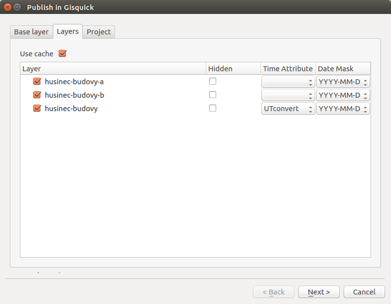
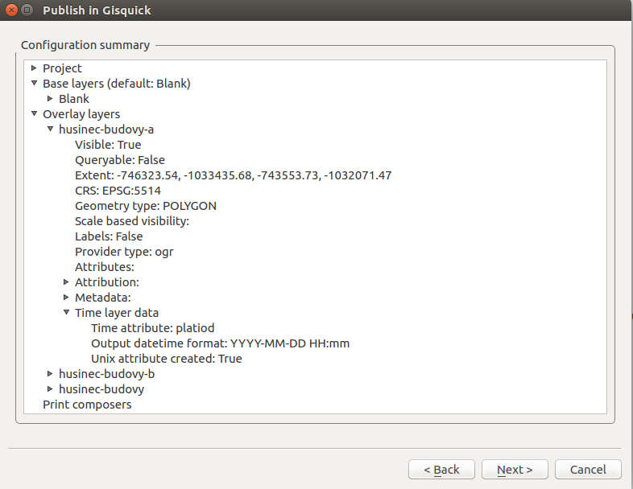
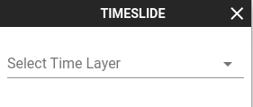
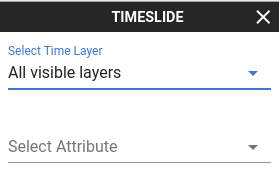
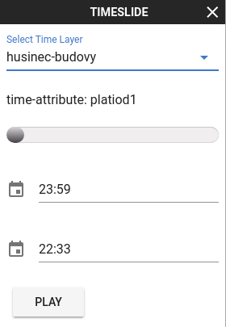
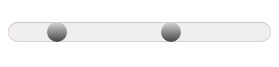
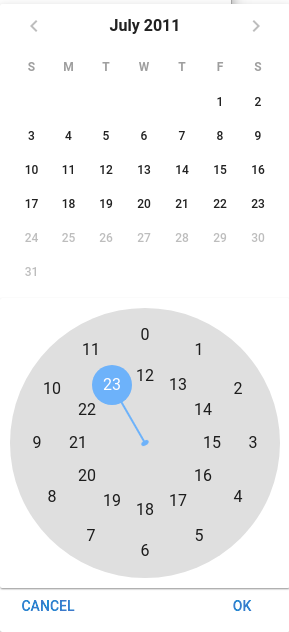

.. |plugin| image:: ../img/logo.png
   :width: 2.5em

.. _project-publishing:
 
==============
 Time support
==============

Time support for Gisquick platforrm allowes users to easily filter 
map content based on its spatio-temporal value. Any vector layer that 
contain attribute with time value may be used. 

This section contains user manual describing process of time layers 
publication in Gisquick plugin for QGIS together with functions of time
filtering tool on Gisquick klient.  

Publication process
---------------------

There is small setings in the first page of the wizard in order to keep 
publication process simple and easy to handle for any user. Time layer 
may be set up in the first page of the wizard in the tab ``Layers`` .
Dropdown menu **Time Attribute** defines which layer attribute contains
time values. In case this column is left blanc layer won't be listed in 
the time filter tool. Second option is **Date Mask**. Time values may 
have different formats in different countries. No matter how original 
time format looks like, date mask offers a posibility to customize 
displayed date format in Gisquick client.

   Time layers options in publication wizard

.. important:: |imp| Every user should know how the data looks like. 
   **Date Mask** changes user interface of the time filtering tool. 
   E. g. if `'HH:mm'` mask is selected datepicker wont be displayed 
   in the client side, only timepicker. 

The **configuration summary** wizard page displays all the parameters 
that were computed for each time layer. Note that if the 
**Time Attribute** field was left blank, parameters will not have any 
vaule.

   Time layers publication summary

Time filtering tool
---------------------

Time filtering tool in Gisquick client is available in the tools menu. 

menu

When the tool is activated dropdown menu with time layers appears on 
the left side of map canvas. For needs of filtration the time layer 
has to be specified. Despite selecting one time layer there is
also posibility of selecting `All visible layers`.

   Dropdown menu containing time layers

It might happen that two time layers with different time extend are 
visible in the same time. E. g. one layer displaying map features 
over one hour and second over one year. Filtering this two layers 
together using one time slider would ignore layer with shorter time 
extend. That is the reason why only time layers with same time 
attribute may be displayed in the same time. In case `All visible 
layers` contains different time attribute. User have to specify one 
in displayed dropdown menu.

   Dropdown menu containing time attributes

Once filtering layer is specified various settings is displayed. 

   Inicialized time filtering tool

Time filtering tool is composed of following parts:

* `Dropdown menu with time layers`
* `Time attribute label`
* `Double rangle slider`
* `Lower and upper time value`
* `Animation button`

Function of **Dropdown menu with time layers** was mentioned before.
If selected time layer was filtered before than time filtering 
tool is initialized using previously used values.

**Time attribute label** displays name of atribut that was selected
in the process of project publishing as `Time Attribute`. This 
comes handy especially when `All visible layers` are selected.

**Double rangle slider** allows user to make fast data filtration.
Time interval is set using two sliders. Map content is refreshed 
each time the slider is changed. Step of double range slider is set 
as one hundredth of time interval size.

   Double range slider

In **Lower and upper time value** labels the time interval may be 
specified with better precision than time slider. Precision depends
on selected output time format in project publication. If format 
contains time and date than labels allow user to choose time in
date and time pickers. In case that time format contains only 
date than time can not be more precise than one day. Time and date 
selection in displayed datetime picker has to be confirmed by 
`'OK'` button. Map canvas is updated after this confirmation.

   Datetime picker

Simple animation may be made using **Animation button**. When 
button is pressed upper value of range slider is being increased 
by its step every second. Every time slider is changed map canvas 
is updated. Once upper value reach slider maximum the lower value 
is increased in same pattern. Animation is end when difference 
between upper and lower value is just one  step. Second  way how 
to stop animation may be click on `STOP` button. It appeares only 
when animation is on.

   Time animation stop button

 

